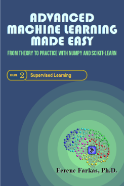
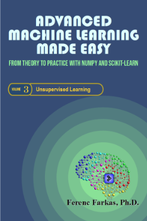

# Advanced Machine Learning
### From Theory to Practice with NumPy and scikit-learn

This is the repository for the Jupyter Notebooks accompanying the 3 volume publication "**Advanced Machine Learning - From Theory to Practice with NumPy and scikit-learn**".

The three volumes are:
- Generalized Linear Models (You can by on [Leanpub](https://leanpub.com/AML1)
- Supervised Learning (You can by on [Leanpub](https://leanpub.com/AML2)
- Unsupervised Learning (You can by on [Leanpub](https://leanpub.com/AML3)

In case you find an error or some explanations might be confusing for you, or some important items you think are missing, please, do not hesitate to provide your feedback by creating an issue. Moreover, if you have any suggestions for improvement you may wish to create a pull request.

These Jupyter Notebooks are made available under the [MIT License](https://opensource.org/licenses/MIT).
