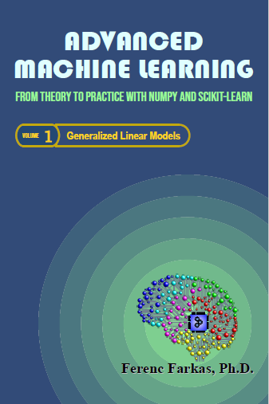
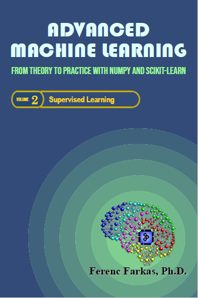
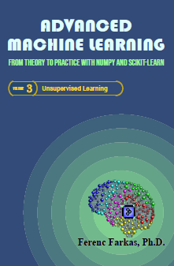

# Advanced Machine Learning
### From Theory to Practice with NumPy and scikit-learn

This is the repository for the Jupyter Notebooks accompanying the 3 volume book "**Advanced Machine Learning - From Theory to Practice with NumPy and scikit-learn**". 

The three volumes are:
- Generalized Linear Models
- Supervised Learning
- Unsupervised Learning

In case you find an error, or some explanations might be confusing for you, or some important items you think that are missing, please, do not hesitate providing your feedback by creating an issue. Moreover, if you have any suggestion for improvement you may wish to create a pull request.

These Jupyter Notebooks, including texts, images and codes, are made available under the MIT License ( <https://opensource.org/licenses/MIT>).

Ferenc Farkas, Ph.D.
